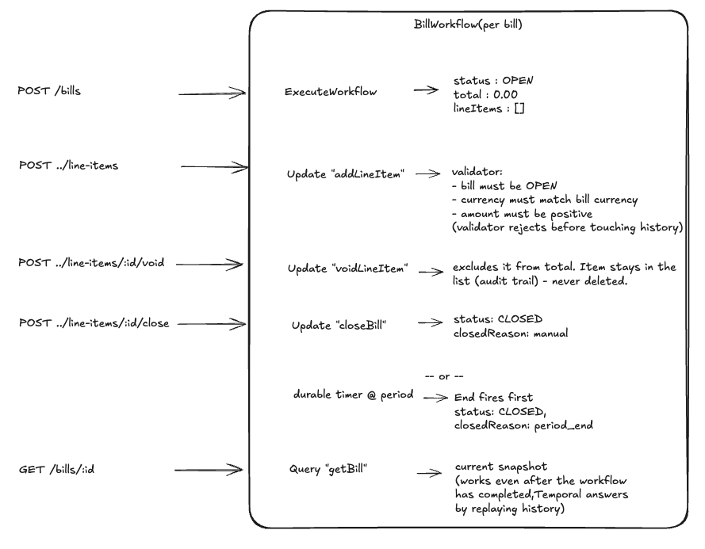
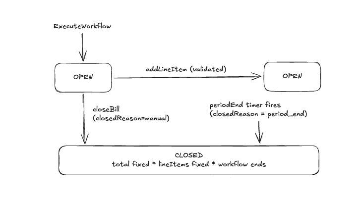

# Fees API

A REST API built with [Encore](https://encore.dev) and backed by [Temporal](https://temporal.io) for
progressively accruing fees over a billing period and closing out a final invoice.

## Architecture: one Temporal workflow per bill

Each bill _is_ a long-running Temporal workflow, started at the beginning of the fee period and completing
when the bill closes. The workflow holds the bill's state (status, running total, line items) entirely in
memory. Temporal persists every state transition durably as workflow history, so nothing is lost across a
crash or deploy.



### Why Temporal, specifically

The assignment asks what problem Temporal is actually solving here. Three things:

1. **Race conditions.** A bill's workflow function is single-threaded, so Temporal serializes every
   `addLineItem` / `closeBill` call against it. Two concurrent "add a line item" requests, or an "add" racing
   a "close", can't interleave into a corrupted total the way they could over a naively-locked database row.
   The [Update Validator](bill/billworkflow/bill_workflow.go) for each handler runs before the request is
   admitted into workflow history, so a rejected call (bill already closed, wrong currency) leaves no trace:
   the caller gets a synchronous, immediate error, and workflow history stays a clean audit log of the
   charges that actually landed.
2. **Long-running timers.** The billing period's end is a durable timer (`workflow.AwaitWithTimeout`), not a
   cron job polling a database for bills whose `period_end` has passed. It fires once, survives worker
   restarts, and needs no separate scheduler.
3. **Reliability and durable state.** The bill's entire history (every line item, in order, with a
   timestamp) comes free as the workflow's event history. A crash mid-period loses nothing; a restarted
   worker just resumes.

### State machine



Once `CLOSED`, the workflow completes. It doesn't linger around waiting for more input. Any
`addLineItem`/`closeBill` call after that point never reaches the in-workflow validator at all: Temporal's
client reports "workflow execution already completed," which the API layer
([`mapBillWorkflowErr`](bill/api.go)) maps to the same `409 Conflict` a validator rejection would produce.
So there are two layers stopping writes to a closed bill: the validator for races that happen within the
bill's lifetime, and Temporal's own completed-workflow semantics for anything after.

`GET /bills/:id` still works after the bill closes, because Temporal answers Queries by replaying history,
and that works for completed workflows too (within the namespace's retention window; the default `temporal
server start-dev` retains history for the life of the process). In a production deployment, closed bills
would also get projected into a durable store, e.g. an Encore SQL database written by an Activity right
before the workflow returns, so invoices stay queryable after Temporal's retention window has passed. That's
out of scope here, but it's a small addition: one `PersistInvoice` activity call before the workflow returns.

## Design decisions

**Money as `int64` minor units plus a currency code, never a float.** See [`bill/money`](bill/money/money.go).

- `Money{Currency: "USD", MinorUnits: 1050}` is exactly $10.50; no `float64` anywhere in the type.
- `ParseDecimal` converts a decimal string (e.g. `"10.50"`) to minor units via string arithmetic, never
  through a lossy `float64` intermediate.
- `Add` is overflow-checked and rejects mismatched currencies outright.
- Amounts cross the wire as decimal strings (`"10.50"`), not JSON numbers, so a client's own float parsing
  can't introduce drift either.

**One currency per bill, fixed at creation.**

- A line item in a different currency is rejected with `400`.
- Summing GEL and USD into a single "total" doesn't mean anything financially, and the requirement asks for
  **the** total amount, singular.
- Splitting a bill into independent per-currency subtotals is a reasonable design too, just a different one.
- Chosen for simplicity, and because it matches how billing periods usually work in practice: a customer is
  billed in one settlement currency.

**Idempotency keys on `addLineItem`.**

- A client retrying "charge $500" after a dropped response shouldn't double-charge.
- The workflow keeps a `map[idempotencyKey]result` and replays the cached result for a repeated key instead
  of adding a second line item.
- Bill creation gets idempotency without any extra code: using the bill's own ID as the Temporal Workflow ID
  means a repeated `POST /bills` with the same `billId` is caught by Temporal's own duplicate-workflow-ID
  handling.

**Line items are voided, never deleted.**

- `POST .../line-items/:id/void` marks a line item reversed (`voided: true`, `voidedAt` set) and excludes it
  from the running total, but it stays in `lineItems` forever.
- A financial record shouldn't lose history because someone made a mistake; it should show the mistake and
  the correction.
- Voiding targets a stable line item ID rather than a fresh charge, so unlike `addLineItem` it doesn't need a
  separate idempotency key: voiding an already-voided item is a no-op that returns the current (voided)
  state, which makes it naturally idempotent on retry.

**Workflow ID reuse policy.**

- `CreateBill` sets `WorkflowIDReusePolicy: RejectDuplicate` and `WorkflowIDConflictPolicy: Fail` explicitly.
- Left at their defaults, a `POST /bills` for an ID whose previous run had already closed would silently
  start a fresh run under the same ID, orphaning the closed bill's data, since `GET`/Query always resolves to
  the latest run for a Workflow ID.
- Rejecting duplicates outright keeps bill IDs permanently unique, the same way real invoice numbers are
  never reused.
- There's a Temporal Go SDK gotcha here worth calling out: `client.ExecuteWorkflow` silently swallows the
  server's `WorkflowExecutionAlreadyStarted` error by default. Even with the reuse/conflict policies above
  set correctly, the server refuses the duplicate start, but the SDK still returns `err == nil` and a handle
  to the existing run, unless `WorkflowExecutionErrorWhenAlreadyStarted: true` is also set on
  `StartWorkflowOptions`. `CreateBill` sets it explicitly for this reason. Verified locally: create a bill,
  let it auto-close, `POST /bills` again with the same `billId`, get `409 already_exists`.

## API

All request/response bodies are JSON. Errors follow Encore's standard shape:
`{"code": "...", "message": "...", "details": null}`.

| Method | Path                                         | Description                                                     |
| ------ | -------------------------------------------- | --------------------------------------------------------------- |
| POST   | `/bills`                                     | Create a new bill for a fee period                              |
| GET    | `/bills/:billID`                             | Get the current snapshot of a bill                              |
| POST   | `/bills/:billID/line-items`                  | Add a line item to an open bill                                 |
| POST   | `/bills/:billID/line-items/:lineItemID/void` | Reverse a line item (kept in the list, excluded from the total) |
| POST   | `/bills/:billID/close`                       | Close a bill, fixing its total and line items                   |

| Scenario                                                    | HTTP status | `code`             |
| ----------------------------------------------------------- | ----------- | ------------------ |
| Success                                                     | 200         | n/a                |
| Missing/unsupported currency, bad amount, empty description | 400         | `invalid_argument` |
| Bill ID / workflow not found                                | 404         | `not_found`        |
| Line item ID not found on the bill                          | 404         | `not_found`        |
| Bill already closed (add, void, or close)                   | 409         | `aborted`          |
| Bill ID already exists (create)                             | 409         | `already_exists`   |
| Temporal unreachable                                        | 503         | `unavailable`      |

> Encore's typed (non-`raw`) endpoints don't currently support setting a custom success status code, so
> `POST /bills` and `POST .../line-items` return `200` rather than the more RESTful `201 Created` plus a
> `Location` header. A `raw` endpoint could get exact control here, at the cost of losing Encore's automatic
> request/response typing and OpenAPI generation. Not worth that trade for this exercise, but it's the
> correct answer for a production API.

### Example: full lifecycle

```bash
# Create a bill for a fee period ending 2026-08-01, tagged with the
# caller's own customer ID for correlation
curl -X POST localhost:4000/bills -d '{
  "billId": "acme-2026-07",
  "currency": "USD",
  "reference": "customer-42",
  "periodEnd": "2026-08-01T00:00:00Z"
}'

# Add line items as usage accrues
curl -X POST localhost:4000/bills/acme-2026-07/line-items -d '{
  "description": "API calls", "currency": "USD", "amount": "10.50"
}'
# => {"lineItem": {"id": "li-1", ...}, "runningTotal": {"amount": "10.50", ...}}
curl -X POST localhost:4000/bills/acme-2026-07/line-items -d '{
  "description": "Storage", "currency": "USD", "amount": "4.49"
}'

# A retried request (same idempotency key) is a no-op, not a double-charge
curl -X POST localhost:4000/bills/acme-2026-07/line-items -d '{
  "description": "Overage fee", "currency": "USD", "amount": "5.00",
  "idempotencyKey": "overage-2026-07"
}'

# Mistaken charge: reverse it, don't delete it
curl -X POST localhost:4000/bills/acme-2026-07/line-items/li-1/void
# => {"lineItem": {"id": "li-1", "voided": true, "voidedAt": "...", ...}, "runningTotal": {"amount": "9.49", ...}}

# Close it out. The voided item is still listed, just excluded from the total
curl -X POST localhost:4000/bills/acme-2026-07/close
# => {"status": "CLOSED", "total": {"amount": "9.49"}, "lineItems": [3 items, one voided], ...}

# Still readable after closing
curl localhost:4000/bills/acme-2026-07

# Rejected: bill is closed
curl -X POST localhost:4000/bills/acme-2026-07/line-items -d '{
  "description": "too late", "currency": "USD", "amount": "1.00"
}'
# => 409 {"code": "aborted", "message": "bill \"acme-2026-07\" is already closed", ...}
```

## Running it

Two things need to be running: a Temporal server, and the Encore app.

```bash
# Terminal 1: Temporal dev server (task queue processing, workflow history)
temporal server start-dev
# gRPC on :7233, Web UI on :8233

# Terminal 2: the Encore app (API + in-process Temporal worker)
encore run
# API on :4000, local dev dashboard on :9400
```

Then exercise it with the `curl` walkthrough above, or through the Encore dev dashboard at
`http://localhost:9400`, which gives request tracing, logs, and a generated API explorer out of the box.

## Testing

```bash
make test-all           # via the Makefile, runs `go mod tidy` first

# or directly:
go test ./...          # everything
go test ./... -race    # race detector; the workflow tests exercise concurrent Update delivery
```

- [`bill/money`](bill/money/money.go): decimal parsing, formatting, overflow and currency-mismatch rejection.
  Pure unit tests, no Temporal involved.
- [`bill/billworkflow/validate_test.go`](bill/billworkflow/validate_test.go): the `addLineItem`/`closeBill`
  business rules (validators) tested as plain Go functions. Kept separate from the Temporal test harness
  deliberately: `TestWorkflowEnvironment` delivers Updates asynchronously relative to when they're issued
  (documented in [`bill_workflow_test.go`](bill/billworkflow/bill_workflow_test.go)), which makes it a poor
  fit for testing a single validator branch in isolation, but a good fit for the integration scenarios below.
- [`bill/billworkflow/bill_workflow_test.go`](bill/billworkflow/bill_workflow_test.go): full
  `TestWorkflowEnvironment`-based scenarios, adding line items and closing manually, a rejected currency
  mismatch leaving state untouched, idempotent retries, auto-close on the period timer, voiding a line item
  (excluded from total, still present, idempotent re-void), and the `getBill` query mid-lifecycle.

## Future considerations

A few things came up while building this that got left out on purpose to keep the submission focused:

- **Line item volume vs. Temporal history limits.** Progressive accrual over a full billing period could
  mean thousands of line items (per-API-call billing, say). Each `addLineItem`/`voidLineItem` Update is a
  workflow history event, and Temporal has a soft ~50MB / 10K-event history ceiling per workflow run. A bill
  open for a long period under high line-item volume would eventually need either periodic `continue-as-new`
  (restarting the workflow with its accumulated state as the new run's input), or moving full line-item
  detail into a database and keeping only a running total and count in workflow memory, with the workflow as
  the authority for whether the bill is open rather than the full ledger.
- **Bulk line item submission.** A `POST /bills/:id/line-items:batch` accepting an array would let a caller
  submit an hour's worth of aggregated usage in one request instead of N. That's a practical efficiency win
  on its own, and combined with the point above, a way to cut the number of workflow history events per unit
  of usage.
- **`GET /bills`, list and filter bills.** The API is currently write-then-fetch-by-ID only: a caller with no
  prior knowledge of a bill ID has no way to discover one. A listing endpoint (filterable by `status`,
  `currency`, `reference`) would serve a reconciliation job or dashboard well, and it's cheap to implement
  without a separate database via Temporal's Visibility API (`ListWorkflowExecutions` with a query over
  workflow type and search attributes), keeping Temporal as the single source of truth instead of adding a
  second store just for listing.
- **Durable projection of closed bills.** `GET` on a closed bill currently relies on Temporal answering
  Queries by replaying history, which only works within the namespace's history retention window. A
  production deployment would add a `PersistInvoice` Activity, called right before the workflow returns,
  that writes the final invoice into an Encore SQL database, making closed invoices durable and queryable
  well past Temporal's retention period, and giving reconciliation and reporting a normal SQL surface to
  query against.
